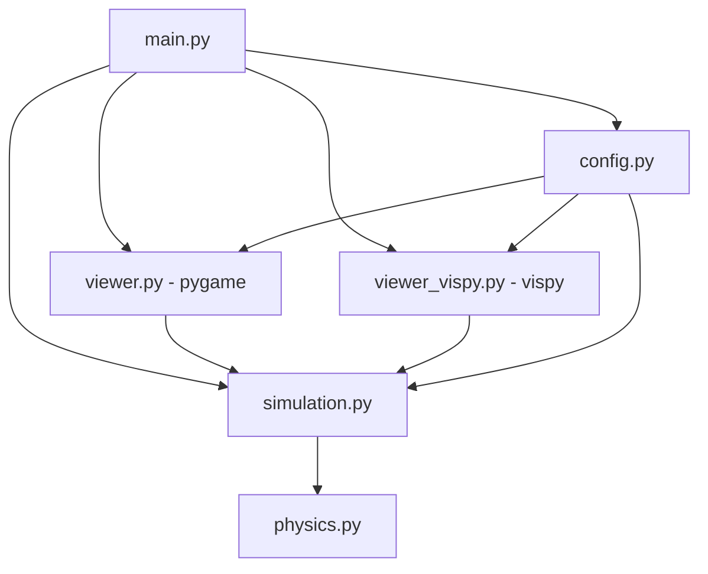

# Data-Science-Projekt-Particles
Particle Life Simulator


**Course:** Data Science & AI Infrastructures (Winter 2025/26)  
**Project:** Biology-inspired algorithms - Emergent Behavior

> A high-performance, Python-based implementation of a "Particle Life" simulation. This project explores emergent complexity arising from simple, local interaction rules between agents.

---

## Project Overview

The **Particle Life Simulator** is an agent-based simulation engine designed to demonstrate how complex, organic-looking patterns (cellular structures, gliders, clusters) emerge from chaos without central orchestration.

The system simulates thousands of particles categorized into distinct types (colors). Their behavior is governed exclusively by a **forces matrix** defining attraction and repulsion rules between types within a limited radius.

**Core Inspiration:**
* [Jeffrey Ventrella's Clusters](http://www.ventrella.com/Clusters/)
* [Particle Life (Hunor Márton)](https://hunar4321.github.io/particle-life.html)

---

## Objectives & Scope

This project aims to deliver a production-grade Python application focusing on algorithmic efficiency and clean software architecture.

### 1. Core Simulation Engine
* **Interaction Matrix:** Implementation of an $N \times N$ matrix defining forces between at least **4 distinct particle types**.
* **Physics Logic:** Time-stepped calculation of velocity, friction, and acceleration based on distance thresholds ($r_{min}$, $r_{max}$).
* **Boundary Conditions:** Toroidal wrapping or reflective boundaries (implementation pending).

### 2. Performance Engineering
* **Optimization Target:** Real-time rendering of **>2,000 particles** at 60 FPS.
* **Profiling:** Continuous bottleneck analysis using `cProfile` and `timeit`.
* **Stack:** Utilization of **NumPy** for vectorized operations and potential JIT compilation via **Numba** to bypass Python interpreter overhead.

### 3. Visualization
* Real-time rendering pipeline (evaluated: `Vispy` vs `Pygame`).
* **GUI Controls:** Dynamic adjustment of interaction parameters (gravity, friction, range) during runtime.

### 4. Software Quality (QA/Ops)
* **CI/CD:** GitHub Actions pipeline for automated linting (`ruff`) and testing.
* **Testing Strategy:** Unit testing suite using `pytest` targeting >70% code coverage.
* **Standards:** Strict adherence to PEP-8 and Type Hinting.

## Software Architecture

The system is designed with a clear separation of concerns, orchestrated by a central controller (`main.py`) which manages the flow between configuration, simulation logic, and visualization.

### Architecture Diagram



### Module Breakdown:

* **Main Controller (`main.py`):** Entry point and mode dispatcher (`console`, `viewer`, `vispy`).
* **Configuration (`config.py`):** Central static parameters (window, physics constants, palette).
* **Simulation Engine (`simulation.py`):** Particle state, update loop, and interaction matrix usage.
* **Physics Kernel (`physics.py`):** Performance-critical force and movement calculations.
* **Pygame Viewer (`viewer.py`):** Interactive 2D viewer with runtime controls.
* **Vispy Viewer (`viewer_vispy.py`):** OpenGL-based viewer for better performance at higher particle counts.

---

## Roadmap

  * **[x] Milestone 1 (19.11.2025):** Project Setup, Architecture Design, CI Pipeline.
  * **[x] Milestone 2 (17.12.2025):** Core Logic Implementation (Physics & Interaction Matrix).
  * **[x] Milestone 3 (17.12.2025):** Real-time Visualization & Parameter Tuning.
  * **[x] Milestone 4 (Completed):** Performance Optimization (>2000 particles).
  * **[ ] Milestone 5 (25.02.2026):** Final Release, Documentation & Presentation.

---

##  Local Development Setup

### Prerequisites

  * Python 3.10+
  * Git

### Installation

```bash
# 1. Clone the repository
git clone https://github.com/41yannik/Data-Science-Projekt-Particles.git
cd Data-Science-Projekt-Particles

# 2. Create virtual environment
python -m venv .venv
source .venv/bin/activate  # Linux/Mac
# .venv\Scripts\activate   # Windows

# 3. Install dependencies
pip install -r requirements.txt
```

### Running the Simulation

```bash
# Console mode (headless, no window)
python -m particle_life.main

# Pygame viewer (interactive, CPU-based rendering)
python -m particle_life.main --mode viewer

# Vispy viewer (OpenGL, recommended for >1000 particles)
python -m particle_life.main --mode vispy
```

### Running Benchmarks & Profiling

```bash
# Profiling: Physics engine with cProfile + scaling analysis
python scripts/profile_simulation.py

# Side-by-side comparison: Brute-Force O(n²) vs. Spatial Hashing O(n)
python scripts/compare_engines.py

# Pygame FPS benchmark (measures rendering performance)
python scripts/test_pygame_fps.py
```

### Running Tests

```bash
# Run all tests
pytest

# Run tests with coverage report
pytest --cov=particle_life --cov-report=term-missing

# Run linter
ruff check
```

### Dependencies

Runtime:

- `numpy` – vectorized physics and linear algebra
- `pygame` – real-time visualization
- `vispy` – OpenGL-accelerated visualization backend
- `PyQt5` – Qt backend used by vispy on desktop

Development and CI:

- `pytest` – unit tests
- `pytest-cov` – coverage measurement and CI threshold
- `ruff` – linting

---

##  Team

  * **Arian Sharifi-Tabar**
  * **Yannik Huber**
  * **Wayan Schmidt**
  * **Azad Aygün**
